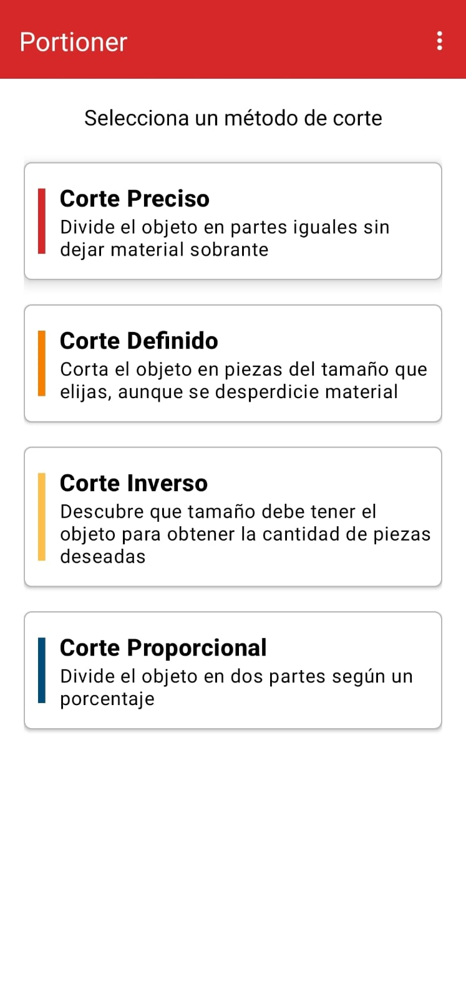
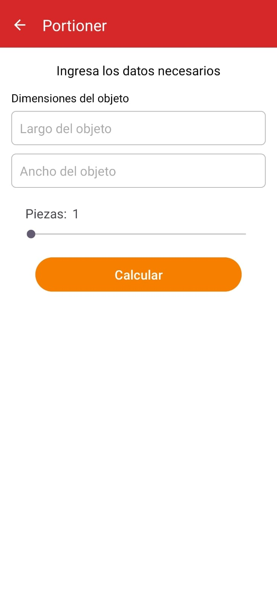
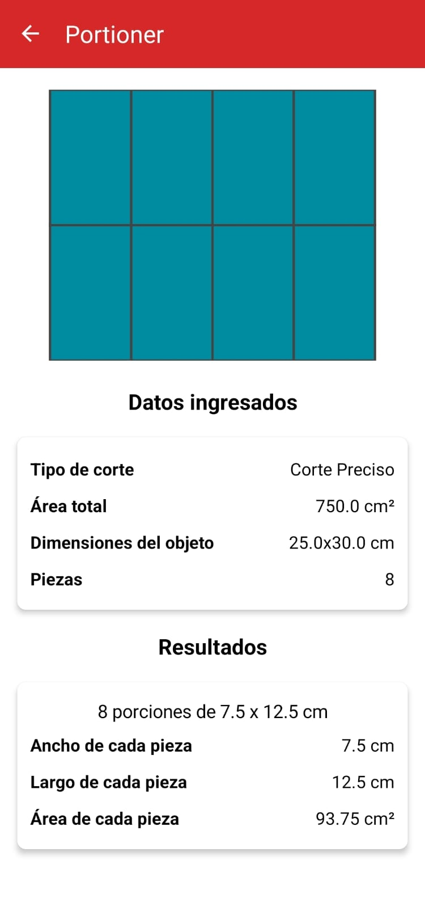
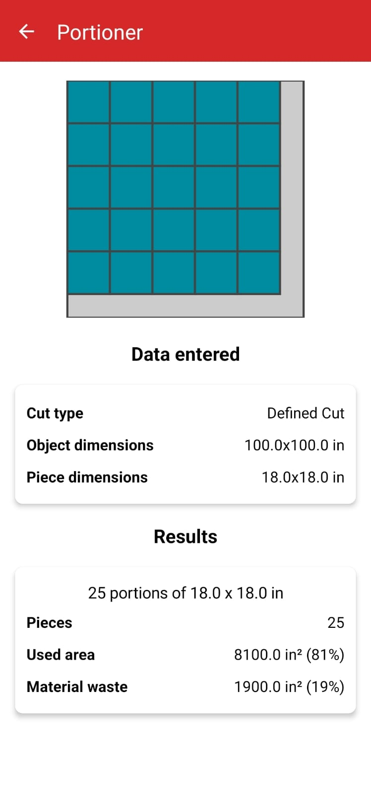

# ✂️ Portioner

**Portioner** es una aplicación Android que ayuda a calcular y visualizar cortes inteligentes en materiales rectangulares. Está diseñada para simplificar decisiones sobre cómo dividir un objeto en piezas con distintos enfoques, optimizando el uso de material y reduciendo desperdicios.

## Propósito del proyecto

Este proyecto surge como una solución para procesos de corte en áreas como carpintería, diseño industrial, cocina o cualquier situación donde sea necesario dividir una superficie en múltiples piezas. La meta es ofrecer una visualización clara, fácil de entender e interactiva del resultado del corte antes de ejecutarlo físicamente.

## Funcionalidades

- Simulación de cortes divididos en cuatro tipos:
  - Corte definido
  - Corte preciso
  - Corte proporcional
  - Corte inverso
- Canvas dinámico para representar visualmente el resultado
- Cálculo de área aprovechada vs. desperdicio
- Interfaz adaptable con soporte para idioma y unidades configurables

## Idiomas

Portioner está disponible actualmente en los siguientes idiomas: 
- Español
- Inglés

## Capturas de pantalla

  
  
  
  

## Tecnología utilizada

- Android (SDK 21+)
- Kotlin
- Jetpack Preferences
- Canvas personalizado
- Diseño Material

## Estado actual

El proyecto está en fase funcional, con énfasis en la lógica de cálculo y la visualización gráfica. Se planea seguir mejorando con más funcionalidades a futuro.

## Créditos

Desarrollado por **Eliud Lucio**, con enfoque en experiencia de usuario, visualización interactiva y diseño funcional.
